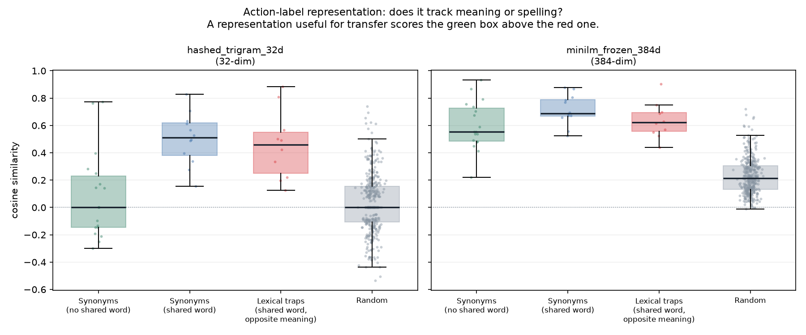

# Action-label representation: frozen sentence embedding vs trigram hash

## 1. Question

The project is moving to a transferable action prior. The current action label representation is a 32-dim character-trigram hash, and `reports/probe_action_representation.json` already showed that its apparent semantic signal is shared-token overlap (0.502 for synonyms sharing a word, 0.081 for synonyms sharing none). This probe asks whether a frozen sentence embedding sees meaning where the hash sees spelling, on the same pairs.

## 2. Representations compared

| representation | dims | description |
|---|---|---|
| `hashed_trigram_32d` | 32 | Signed blake2b character-trigram hashing, L2-normalised (current). |
| `minilm_frozen_384d` | 384 | sentence-transformers/all-MiniLM-L6-v2, frozen, mean-pooled, L2-normalised. |

## 3. Cosine similarity by pair kind

| pair kind | n | hashed_trigram_32d mean | minilm_frozen_384d mean |
|---|---|---|---|
| synonym no shared token | 18 | +0.081 | +0.599 |
| synonym shared token | 12 | +0.502 | +0.714 |
| lexical trap | 10 | +0.456 | +0.636 |
| random | 400 | +0.030 | +0.229 |

## 4. The decisive contrast

A representation that tracks **meaning** scores synonyms-with-no-shared-word *above* lexical traps. One that tracks **spelling** does the opposite — and a spelling-based representation is actively harmful, because it scores the control that commits a flow and the one that abandons it as similar.

| representation | synonyms(no shared word) − lexical traps | 95% CI | tracks meaning |
|---|---|---|---|
| `hashed_trigram_32d` | **-0.375** | `[-0.5775, -0.1645]` | **NO** |
| `minilm_frozen_384d` | **-0.038** | `[-0.1502, 0.0748]` | **NO** |

- **`hashed_trigram_32d`** — Synonyms that share no word score -0.375 against pairs that share a word and mean the opposite (95% CI [-0.578, -0.165]). The representation does NOT separate meaning from spelling: a control that commits a flow and one that abandons it are scored as similar whenever they share a word.
- **`minilm_frozen_384d`** — Synonyms that share no word score -0.038 against pairs that share a word and mean the opposite (95% CI [-0.150, +0.075]). The representation does NOT separate meaning from spelling: a control that commits a flow and one that abandons it are scored as similar whenever they share a word.

## 5. Supporting contrasts

| contrast | hashed_trigram_32d | minilm_frozen_384d |
|---|---|---|
| no shared token synonyms minus random | +0.050 `[-0.0874, 0.2018]` | +0.369 `[0.2891, 0.4495]` |
| shared token synonyms minus no shared token synonyms | +0.421 `[0.2388, 0.5941]` | +0.115 `[0.0162, 0.2162]` |
| lexical traps minus random | +0.425 `[0.2816, 0.5791]` | +0.407 `[0.3322, 0.4887]` |

`shared token synonyms − no shared token synonyms` is the spelling-dependence measure: near zero means the representation reads the two the same way, and a large positive value means it is reading characters.

## 6. Plot



## 7. Secondary analyses (post hoc)

> Added after the primary statistic was seen. Reported alongside it, never in place of it.

**A2's commit-versus-abandon anchor axis.** Not a pairwise similarity: each label is projected onto `max cos(positive anchors) - max cos(negative anchors)`, using the anchors frozen in the methodology document before this probe existed.

| representation | commit mean | abandon mean | separation | 95% CI | rank AUC |
|---|---|---|---|---|---|
| `hashed_trigram_32d` | +0.129 | -0.152 | **+0.281** | `[0.0977, 0.4531]` | **0.764** |
| `minilm_frozen_384d` | +0.316 | -0.175 | **+0.491** | `[0.3766, 0.6086]` | **1.000** |

**Cross-vocabulary synonymy, measured against each encoder's own null.** Raw cosines are not comparable between a 32-dim sparse hash and a 384-dim dense embedding, because their random baselines differ (+0.030 against +0.229).

| representation | synonyms (no shared word) | random | margin | margin in random SDs |
|---|---|---|---|---|
| `hashed_trigram_32d` | +0.081 | +0.030 | +0.051 | **0.24** |
| `minilm_frozen_384d` | +0.599 | +0.229 | +0.369 | **2.86** |

## 8. Decision

**Primary statistic: both representations fail, and that stands.** Neither separates meaning from spelling pairwise — the hash at -0.375 and MiniLM at -0.038 (CI [-0.1502, 0.0748], containing zero). MiniLM scores `Place order` against `Cancel order` as highly as it scores genuine synonyms, because sentence embeddings encode topic rather than polarity. **The direct consequence: raw pairwise label cosine must not be used as a policy feature, in either representation.** It would tell the agent that the control which commits a workflow and the one that abandons it are the same kind of thing.

**Secondary, post hoc: the two representations are nonetheless far apart on the two properties transfer actually needs.**

1. *Cross-vocabulary synonymy.* Measured against each encoder's own null, MiniLM puts no-shared-word synonyms **2.86 random SDs** above chance; the hash manages **0.24**. Recognising that `Place order` on one application and `Submit purchase` on another are the same control is the whole mechanism a transferable prior would rely on, and the hash effectively cannot do it.

2. *Polarity, via a projection rather than a similarity.* On A2's frozen positive-minus-negative anchor axis, MiniLM separates commit-style labels from abandon-style ones with rank AUC **1.000** against the hash's **0.764** (mean separation +0.491, CI [0.3766, 0.6086]). The polarity that pairwise cosine loses is recoverable by projecting onto a task-relevant axis — which is what A2 already does, frozen before this probe was written.

**Decision: adopt the frozen sentence embedding for the action label, as a feature vector for a learned scorer and for anchor projections — never as a raw pairwise similarity.** The trigram hash stays where it is correct, which is identity work: state deduplication, the archive, and novelty counting, where spelling *is* the question being asked. That is the architectural split the project direction states as 'identity is for counting, semantics are for learning', and this probe is the measurement behind it.

## 9. Limitations

- One pair list, written for the earlier probe and reused unchanged. It is web-UI vocabulary, not a general semantic benchmark.
- Cosine between label embeddings is a property of the encoder, not evidence that a policy will exploit it. Whether the agent uses the signal is a separate question this probe cannot answer.
- The lexical traps are adversarial by construction. A representation that scores them low is doing the right thing here, but the set is small (10).
- MiniLM is frozen and general-purpose. It has not been adapted to web UI vocabulary, which is deliberate: an adapted encoder would be trained on these fixtures and could not then be used to argue transfer.

## 10. Exact command

```bash
python scripts/probe_semantic_vs_hash.py
```
